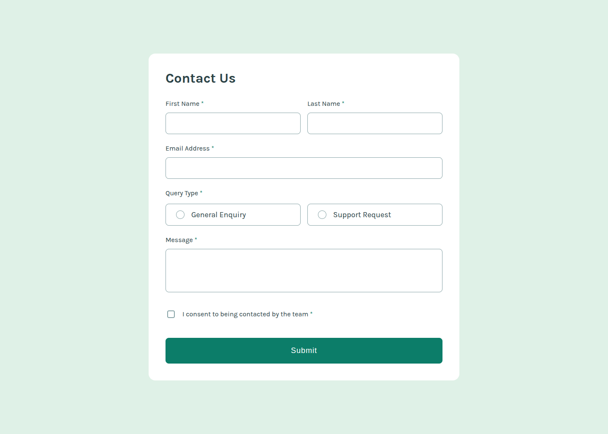

# contact-form
This is a solution to the [Contact form challenge on Frontend Mentor](https://www.frontendmentor.io/challenges/contact-form--G-hYlqKJj).

## Table of contents

- [Overview](#overview)
  - [The challenge](#the-challenge)
  - [Screenshot](#screenshot)
  - [Links](#links)
- [My process](#my-process)
  - [Built with](#built-with)
  - [What I learned](#what-i-learned)
  - [Continued development](#continued-development)
  - [Useful resources](#useful-resources)
- [Author](#author)

## Overview

### The challenge

Users should be able to:

- Complete the form and see a success toast message upon successful submission
- Receive form validation messages if:
  - A required field has been missed
  - The email address is not formatted correctly
- Complete the form only using their keyboard
- Have inputs, error messages, and the success message announced on their screen reader
- View the optimal layout for the interface depending on their device's screen size
- See hover and focus states for all interactive elements on the page

### Screenshot



### Links

- Solution URL: [github.com/rizanne-f/contact-form](https://github.com/rizanne-f/contact-form)
- Live Site URL: [rizanne-f.github.io/contact-form/](https://rizanne-f.github.io/contact-form/)

## My process

### Built with

- Semantic HTML5 markup
- CSS custom properties
- Flexbox
- Mobile-first workflow

### What I learned

Instead of putting the asterisk '*' mark for required input fieds inside `<span>`, I put it inside `::after` pseudo-element and used an empty alternative value so it won't be read by screen readers.
```css
.name label::after,
.email label::after,
legend::after,
.message label::after,
.contact-consent label span:last-child::after {
    content: " *" / "";
    color: var(--Green-600);
    white-space: nowrap;
}
```
Setting `white-space: nowrap;` also helped in making sure the asterisk won't transfer to new line on its own on smaller devices, instead it will be attached to the previous word.

For custom radio buttons and checkbox, it was easier for me to use the provided svg when putting it as background for pseudo elements.
```css
.radio-mark::after {
    content: "";
    position: absolute;
    inset: -0.125rem;
    background: url("./assets/images/icon-radio-selected.svg") no-repeat center / var(--size-radio) var(--size-radio);
    opacity: 0;
    transition: var(--transition-fast);
}

.checkmark::after {
    content: "";
    position: absolute;
    inset: 0;
    background: url("./assets/images/icon-checkbox-check.svg") no-repeat center / var(--size-checkbox) var(--size-checkbox);
    opacity: 0;
    transition: var(--transition-fast);
}
```

I also want to get into the habit of properly setting the accessiblity of a web page. In this project, I added them on input fields and the dialog element.
```html
<div class="first-name">
    <label for="first-name">First Name</label>
    <input
        type="text"
        id="first-name"
        aria-describedby="first-name-error"
        aria-invalid="false"
        enterkeyhint="next"
        required
    >

    <div id="first-name-error" aria-live="polite" class="invalid feedback">
        This field is required
    </div>
</div>
```
```html
<dialog aria-labelledby="dialog-header" aria-describedby="dialog-content">...<dialog>
```
I also did not add `main` landmark role as I was already using the `<main>` element for the content of the page.


### Continued development

I did my best to use the appropriate ARIA attributes in the correct fields. But I still have a lot to learn about this topic.

There is also an opportunity for me to learn more about using SVG. I want to learn how to animate and use it to create fun interactions with the user.

### Useful resources
- [Did You Know This One HTML Attribute Can Instantly Improve Mobile UX?](https://medium.com/@Angular_With_Awais/did-you-know-this-one-html-attribute-can-instantly-improve-mobile-ux-338b1e2ec3a8) - `enterkeyhint` was new to me. This article gave me valuable info on when and how to use this attribute.
- [inputmode HTML global attribute](https://developer.mozilla.org/en-US/docs/Web/HTML/Reference/Global_attributes/inputmode) - There is also the `inputmode` attribute that can be used alongside `enterkeyhint` for full control over keyboard layout.
- [Consistency in mandatory fields: Emphasis on asterisk (*) convention](https://medium.com/@vicentegrafico.com/consistency-in-mandatory-fields-emphasis-on-asterisk-convention-ff42bcc5fe06) - This was an interesting read about asterisk for mandatory fields.
- [How to hide text in CSS pseudo elements from screen readers](https://whitep4nth3r.com/blog/hide-text-in-css-pseudo-elements-from-screen-readers/) - A simple fix to prevent screen readers from reading the asterisk inside pseudo element.
- [Stop Rebuilding Modals: A Deep Dive into the `<dialog>` Element](https://medium.com/@beiselanja/stop-rebuilding-modals-a-deep-dive-into-the-dialog-element-4580cdbb7b20) - Contains useful information about dialog, modal implementation, and accessibility.

## Author

- LinkedIn - [Rizanne Fernandez](https://ph.linkedin.com/in/rizanne-fernandez)
- Frontend Mentor - [@rizanne-f](https://www.frontendmentor.io/profile/rizanne-f)
- Twitter - [@rizanne621](https://www.twitter.com/rizanne621)